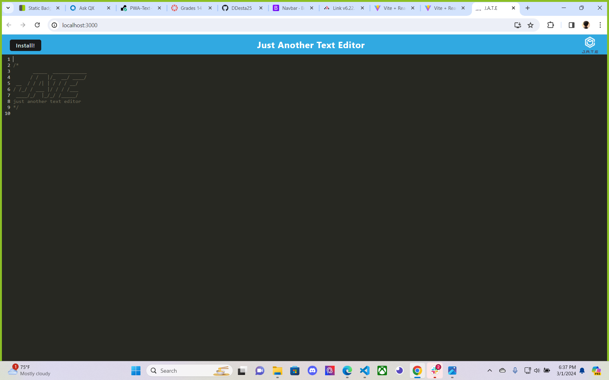

# PWA-Text-Editor

## About The Project
This project was built using Webpack, Babel, and CodeMirror to create a progressive web app text editor themed around jate

  
    

  ## Description
  
  This project was creating a text editor that runs in the browser. The app is a single-page application that meets the PWA criteria. Additionally, it features a number of data persistence techniques that serve as redundancy in case one of the options is not supported by the browser. The application will also function offline.

  ## Deployment link 
  https://pwa-text-editor-xeab.onrender.com/
  
  ## Table of Contents 
  
  
  
  - [Installation](#installation)
  - [Usage](#usage)
  - [Credits](#credits)
  - [License](#license)
  
  ## Installation
  
npm i all dependencies

{
  "name": "JATE",
  "version": "1.0.0",
  "description": "",
  "main": "server.js",
  "scripts": {
    "start:dev": "",
    "start": "",
    "server": "",
    "build": "",
    "install": "",
    "client": ""
  },
  "keywords": [],
  "author": "",
  "license": "ISC",
  "dependencies": {
    "express": "^4.17.1",
    "if-env": "^1.0.4"
  },
  "devDependencies": {
    "concurrently": "^5.2.0",
    "nodemon": "^2.0.4"
  }
}

## Screenshots

  ## Usage
  
  
To run in the app locally, run npm i to install all you're dependencies.

Then, run npm run start to launch the application

To install the application while it's running locally, open the application at https://localhost:3000 and click on the install button

You can follow the prompts to complete the installation to operate this app offline if need be.
  
  
  ## License
  
A short and simple permissive license with conditions only requiring preservation of copyright and license notices. Licensed works, modifications, and larger works may be distributed under different terms and without source code.
  [https://choosealicense.com/licenses/mit/](https://choosealicense.com/licenses/mit/)

  
  ## How to Contribute
  Daniel Desta

https://github.com/DDesta25/PWA-Text-Editor
  
  ## Tests
  npm start
  npm run start
## Acknowledgments
I would like to appreciate the help from my TA Mary, and my instructor John for all the help to get this done.